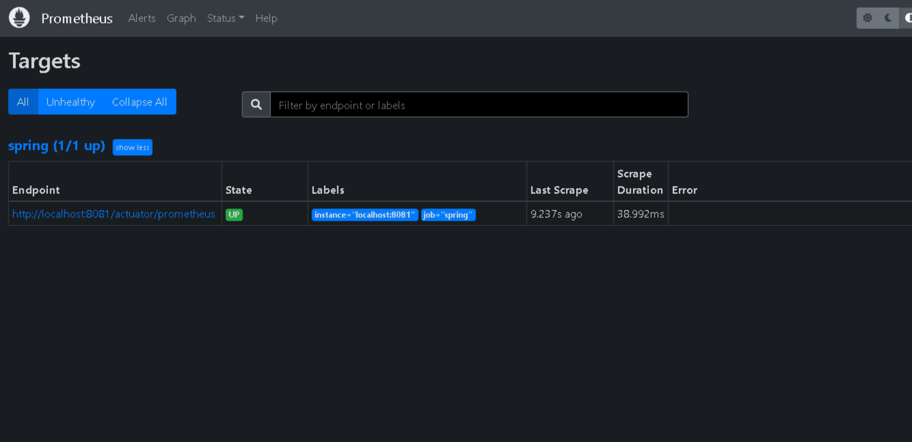
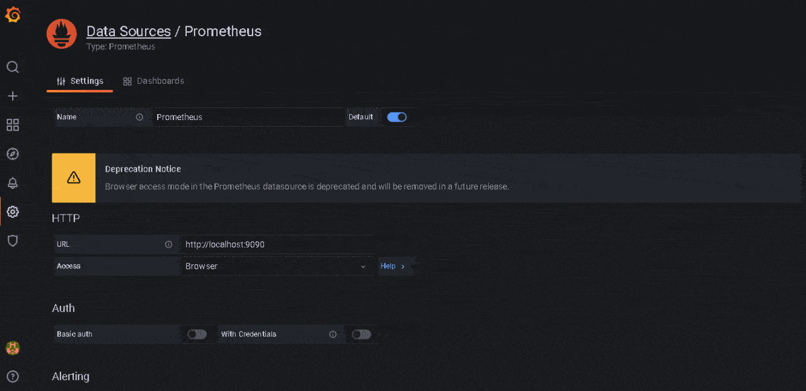

#  Back-end Sistema de Cadastro com monitoramento


## Tabela de conteúdos
   * [Sobre](#sobre)
   * [Tecnologias](#tecnologias)
   * [Instalação](#instalação)
   * [Como rodar a aplicação](#como-rodar-a-aplicação)
      * [Back-End](#back-end)
      * [Monitoramento](#monitoramento)
   * [Demonstração do monitoramento](#demonstração-do-monitoramento)

## Sobre
Este repositório contém um Back-end de Sistema de Cadastro de Usuários simples no qual possui apenas métodos para criar e consultar, por paginação, os usuários registrados. O Objetivo principal desta aplicação é retornar dados que serão extraídas pelo monitoramento das ferramentas Prometheus e Grafana.

Para uma melhor experiência, é recomendado utilizar o Front-end deste sistema. Clique [AQUI](https://github.com/Oraculum-Fatec/sistema-cadastro) para acessar o seu repositório.


## Tecnologias
- [Java Spring Boot](https://spring.io/projects/spring-boot)
- [Maven](https://maven.apache.org/)
- [MySQL](https://grafana.com/)
- [Promethues](https://prometheus.io/)
- [Grafana](https://grafana.com/)
- [Docker](https://www.docker.com/)


## Instalação
Para começar, será necessário instalar em sua máquina as seguintes ferramentas:
[Git](https://git-scm.com), [Java Development Kit](https://www.oracle.com/java/technologies/downloads/), [Maven](https://maven.apache.org/download.cgi), [MySQL](https://dev.mysql.com/downloads/) e opcionalmente o uso do [Docker](https://www.docker.com/) para facilitar a instalação e execução das ferramentas de monitoramento.

Será necessário configurar as variáveis de ambiente do Maven e do Java.

Para o monitoramento da aplicação será necessário baixar o [Prometheus](https://prometheus.io/download/) e o [Grafana](https://grafana.com/get/?plcmt=top-nav&cta=downloads&tab=self-managed).


## Como Rodar a Aplicação
Segue abaixo o passo a passo para configurar e executar o Back-end e o seu monitoramento:

### Back-end
Primeiramente será necessário clonar o repositório em sua máquina local com o comando:

      git clone https://github.com/Oraculum-Fatec/sistema-cadastro-backend.git

Configure o arquivo localizado em ```src/main/resources/application.properties```, altere a porta e o nome do banco de dados no campo ```spring.datasource.url```, defina o usuário que acessará o banco de dados a partir de ```spring.datasource.username``` e sua senha em ```spring.datasource.password```.

Em seguida, para instalar as dependências:

      mvn install
      
Execute o back-end com:
 
      mvn spring-boot:run


### Monitoramento
Com o Prometheus instalado, acesse o diretório do Prometheus e substitua o atual arquivo ```prometheus.yml``` pelo o outro disponibilizado neste repositório, e então execute o Prometheus com o comando:

      prometheus --config.file=prometheus.yml
 
Usando o Docker, baixe a imagem do Prometheus com o comando:

      docker pull prom/prometheus
      
Execute o container do Prometheus utilizando do arquivo ```prometheus.yml``` disponibilizado neste repositório com o comando:
  
      docker run -d -p 9090:9090 -v <PATH_DO_ARQUIVO_prometheus.yml>:/etc/prometheus/prometheus.yml prom/prometheus

Para acessá-lo, abra o navegador na porta padrão do Prometheus: ```localhost:9090```.

Com o Grafana instalado, apenas acesse ```localhost:3000``` no navegador, caso a conexão falhe, verifique se o serviço do Grafana está em funcionamento.

Usando o Docker, execute o container do Grafana com o comando abaixo e depois abra o navegador na porta padrão do Grafana: ```localhost:3000```:

      docker run -d -p 3000:3000 grafana/grafana

Na interface do Grafana, acesse a opção ```Data sources``` na aba ```Configuration```, clique em ```Add data source``` e selecione o Prometheus na categoria ```Time series databases```. Após isso, nomeie seu database, altere a URL para a porta padrão do Prometheus: ```localhost:9090```, configure ```Access``` para ```Browser``` e, por fim, clique em ```Save & test```.

Após adicionar o Data Source, vá para opção ```import``` na aba ```Create```, insira o ID de número 4701 no campo ```Import via grafana.com```. Em seguida, será retornado o Dashboard nomeado JVM(Micrometer), como o seu nome indica, configurado para exibir métricas disponíveis em aplicações feitas em Java. Adicione no campo  ```Prometheus``` o Data source anteriormente criado e finalize a importação clicando em  ```Import(Overwrite)```.

## Demonstração do Monitoramento
Abaixo é possível observar que a aplicação está sendo alvejava pelo Prometheus, como também realiza consultas do estado atual da aplicação.

<p align="center">
  
</p>

Temos também, uma breve demonstração da configuração do Grafana e dos dados exibidos a partir do Dashboard importado.

<p align="center">
  
</p>
